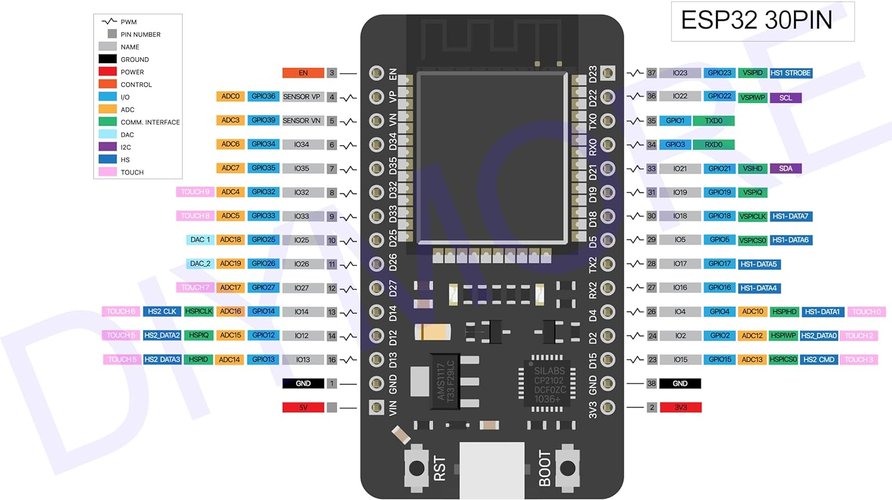
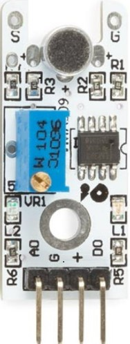
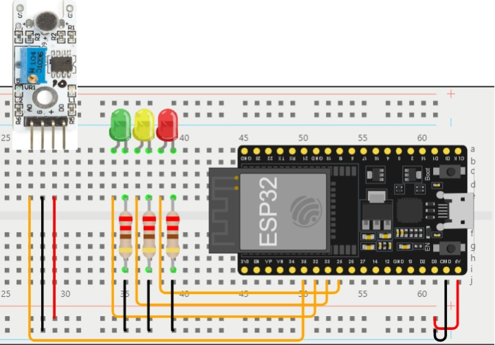
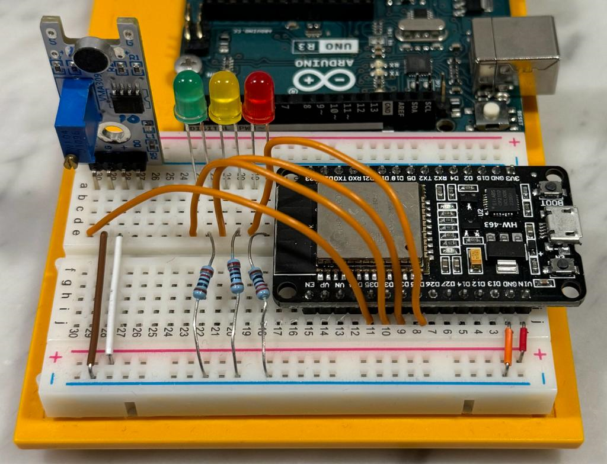
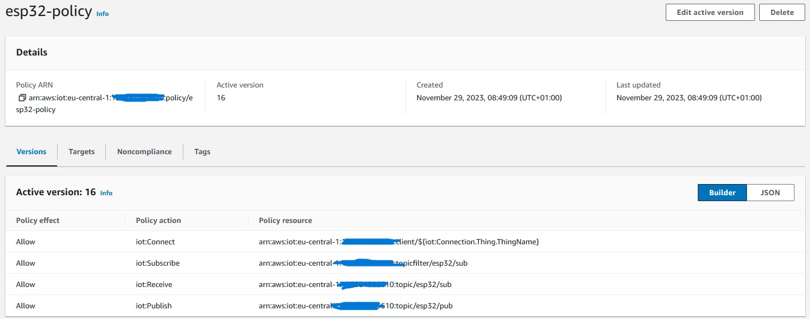
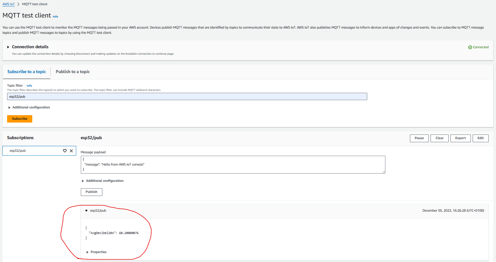
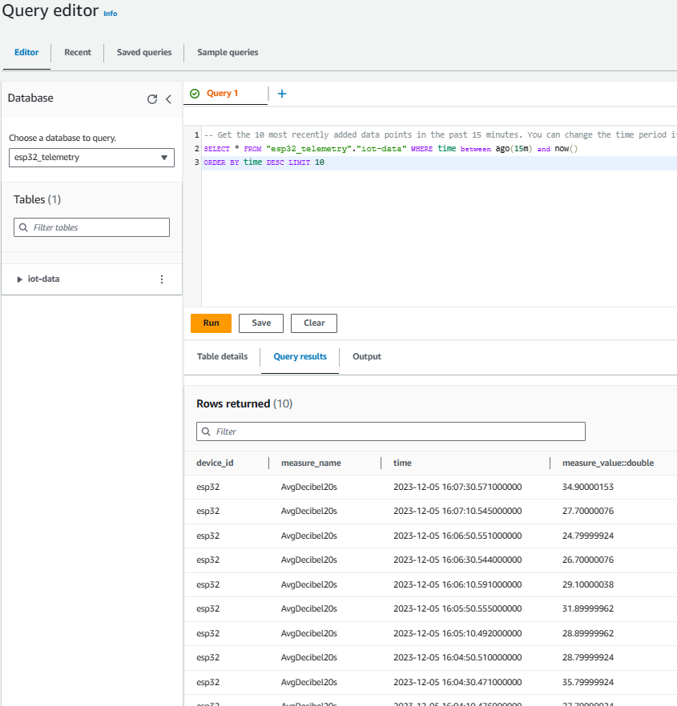
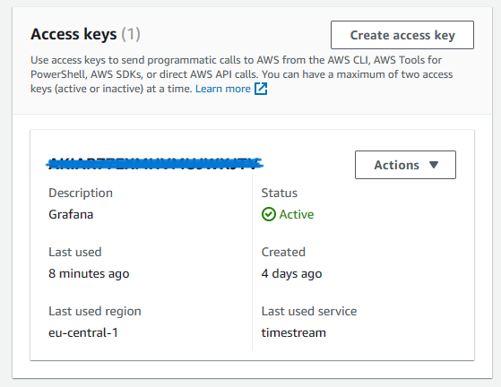
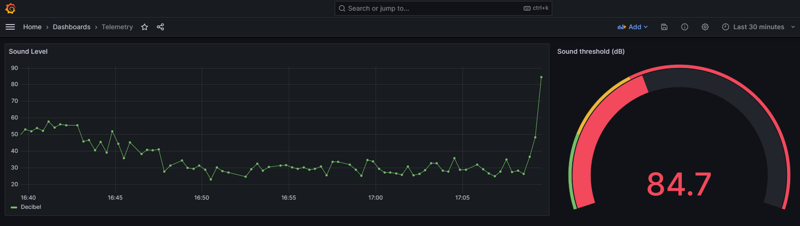
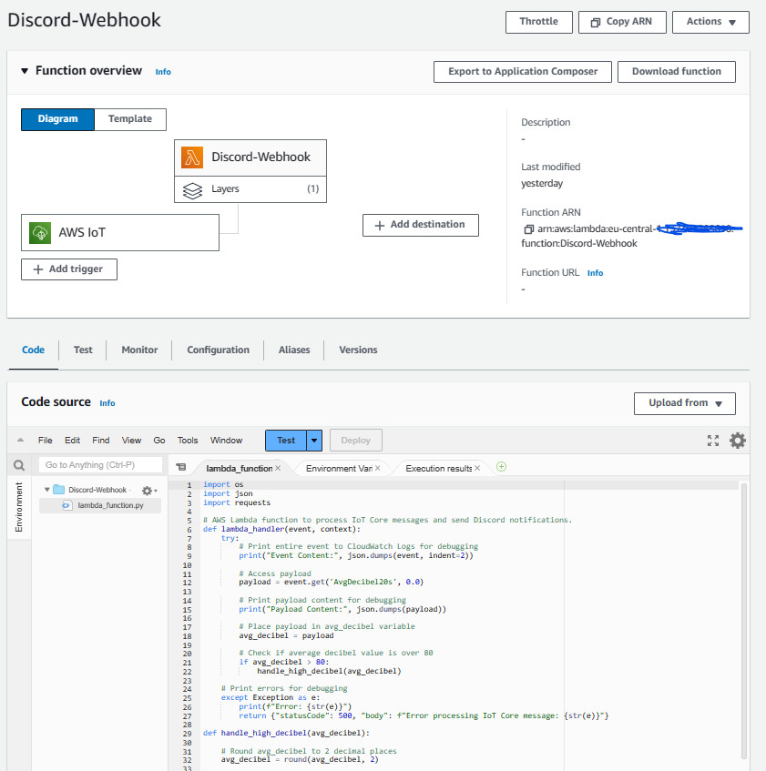

# Sound Monitoring System
An IoT solution with Amazon Web Services (AWS) for monitoring and visualizing sound levels (decibels). 

- Table of content:
  - [Background](#Background)
  - [Problem statement](#Problem-statement)
  - [Solution overview](#Solution-overview)
    - [Hardware setup](#hardware-setup)
      - [ESP32 microcontroller](#ESP32)
      - [WPSE309 sound sensor](#Sound-sensor)
      - [Wiring](#Wiring)
    - [Software setup](#Software-setup)
      - [Arduino IDE](#Arduino-IDE)
      - [AWS IoT Core](#AWS-IoT-Core)
      - [Message routing](#Message-routing)
        - [Timestream Database - IAM - Grafana](#Timestream-Database-IAM-Grafana)
        - [Action trigger - Lamda functions - Discord](#Action-trigger-Lamda-functions-Discord)
  - [Security and scalability](#Security-and-scalability)

## Background
This project was developed as part of the course "IoT and Cloud-services" at Nackademin. The objective was to address a hypothetical case or problem by creating an IoT solution using either AWS or Microsoft Azure.

## Problem statement
High noise levels in residential areas can lead to disputes between neighbors. To better understand and address this problem, the objective of this project was to develop a solution for monitoring sound levels within an apartment. The system is designed to alert the user whenever the sound level exceeds a predetermined threshold.

## Solution overview
Addressing the identified problem, this project introduces a sound monitoring system that incorporates a WPSE309 sound sensor connected to an ESP32 microcontroller. The ESP32 establishes communication, over WiFi, with an AWS IoT Core Topic using the MQTT protocol.

The AWS IoT Core Topic is configured with message routing rules, directing all incoming messages to an Amazon Timestream database which stores the telemetry and also provides a Grafana dashboard with information. To be able to visulize the data and for increased security, AWS Identity and Access Management (IAM) provides Grafana the necessary access it needs to Timestream, through an access key. 

Additionally, if the incoming decibel level exceeds 80 dB, a message routing rule triggers a Lambda function, which sends an alert notification to Discord via a Webhook API.


*Architecture*

### Hardware setup
#### ESP32 microcontroller: 
The ESP32 is a versatile microcontroller developed by Espressif Systems. It features a dual-core processor, built-in Wi-Fi and Bluetooth capabilities. The ESP32 is widely used in IoT projects due to its low power consumption, cost-effectiveness, and robust performance.


*Pin map*

#### WPSE309 Sound sensor: 
This highly sensitive sound detector with 2 outputs (1 analog and 1 digital) measures sounds between 48 and 66 dB. The AO or analog output generates a real-time voltage output signal from the microphone, while the DO or digital output depends on the sound level and the set sound threshold.


*WPSE309*

#### Wiring: 
The sound sensor module is connected with 3 pins to the ESP32 microcontroller: A0 (analog output), power supply (+) and ground (G).  In this way, we can read the analog value (voltage) of the sound sensor and convert it into decibel levels. The external LEDs is connected to 3 digital pins of the ESP32 microcontroller and to prevent the LED against too high voltages, resistors in the series of 220Ω is used. 


*Wiring diagram*


*My wiring*

### Software setup
#### Arduino IDE: 
The Arduino IDE is used to program the ESP32 microcontroller. The code (C/C++) includes functions to connect to Wi-Fi, to AWS, publish/subscirbe messages and control the LEDs based on decibel levels. `dB >= 30 && dB < 50 ==> "Quiet"`, `dB >= 50 && dB < 80 ==> "Moderate"`, `dB >= 80 && dB <= 100 ==> "Loud"`. Important to note is that it is the average decibel value over a 20 second period that is published to AWS. This is done because the absorption capacity of the sensor fluctuates over time, and averaging the decibel values over a 20-second period provides a more stable and representative measure of the ambient sound levels.
```
void setup() {
  Serial.begin(115200);

  // Connect to Wifi and AWS
  connectToWifi();
  delay(1000);
  connectToAWS();

   ...Rest of the setup code...
````
```
void loop() {
  Main loop code starts...

  controlLEDs(dB);
  
  float average = calculateAverageDecibel(dB);
  if (average > 0) {
    publishMessage(average);
  }

  ...Rest of the loop code...
}
````
Another important thing to note is the scaling of the analog reading range. The sensor has an absorption capacity of 48-66 decibels, this sound range is simulated to a range of 28-100 decibels in order to create a more "real-life" scenario.

Also, it is worth knowing that decibels are measured on a logarithmic scale; the amplitude of sound waves. Using a map function, as shown below, is a simplification. It assumes a linear approximation to convert the analog voltage readings to a decibel scale. The actual relationship between voltage and sound intensity is logarithmic, and a linear mapping may therefore not perfectly represent the true nature of decibels.

```
// Set peaktopeak value (represents the amplitude)  
peakToPeak = signalMax - signalMin;

// Scale the peakToPeak value from the analog readings range 150-335 to the range 28-100 (dB)
int dB = map(peakToPeak, 150, 335, 28, 100);
```

#### AWS IoT Core:

The AWS IoT Core serves as a central hub for managing, connecting, and securing IoT devices. In order to mirror the presence of the ESP32 in the cloud, a corresponding "thing" was established. An IoT thing is a representation and record of the physical device in the cloud. 

To regulate access to AWS IoT Core data plane operations, AWS IoT policies come into play. Note that these policies are distinct and separate from IAM (Identity and Access Management) policies. Unlike IAM policies, AWS IoT policies specifically govern AWS IoT data plane operations. For the ESP32, these policies were incorporated and stored directly within the embedded program of the device through X.509 certificates.

The MQTT test client was also frequently used to monitor the MQTT messages being passed to the IoT Core.


*Polices*

*MQTT test client*

#### Message routing:
Message Routing rules are configured to analyze and process incoming messages from the esp32 microcontroller and forward them to an AWS endpoint. In this case, the solution contains two different data flows:

1. **Timestream database - IAM - Grafana:** 

All incoming messages to IoT Core are routed to the Timestream database. Employing the rule `SELECT * FROM 'esp32/pub'`, Timestream captures and stores sound level telemetry over time.


*Timestream query*

In this configuration, an IAM user named `api-user-grafana` was created with associated access keys. Grafana was then configured to utilize these access keys in order to be able to interact with the Timestream database. IAM policies was also applied to `api-user-grafana`, in this case *AmazonTimestreamReadOnlyAccess*, defining specific permissions for actions with the Timestream database.


*Access key*

Grafana was used as the visualization layer. It connected to Timestream using the provided access keys mentioned above and queries the database for sound level data. The queried data is then used to populate a dashboard, providing a visual representation of the sound levels over time.


*Grafana dashboard*

1. **Action trigger - Lamda functions - Discord:**

In all incomming messages to the IoT Core where the sound sensor has detected a high decibel value, the rule `SELECT * FROM 'esp32/pub' WHERE AvgDecibel20s > 80.0` filters messages based on the condition that the average decibel level (AvgDecibel20s) exceeds 80.0.

When a message meets the specified conditions, the Message Routing rule triggers an action that activates a Lambda function.


*Lambda*

The Lambda function, having identified an average decibel level surpassing 80.0, initiates a notification action. This action involves sending an alert message to Discord through a designated Webhook API. The Discord channel receives the alert notification, providing real-time information about the high sound levels detected by the sound sensor.


*Discord notification*

## Security and Scalablility

**Security Measure:** Certificate Management

- Current Approach: Utilizing X.509 certificates for TLS connections to ensure secure communication between the ESP32 and AWS IoT Core.
- Concerns: Hardcoding certificates and keys in the Arduino IDE poses security risks, especially with the potential for unauthorized access.
- Proposed Improvement: Implement AWS Key Management Service (KMS) to centrally manage and distribute keys and certificates securely.
- Benefits: Centralized control enhances security by safeguarding against unauthorized access. Simplifies key and certificate distribution, contributing to a more robust and scalable security infrastructure.

**Security Measure:** Least Privilege Principle

- Current approach: Leveraging AWS roles and policies to customize privileges is limited.
- Concerns: Potential security issues can arise from insufficiently customized roles and policies.
- Suggested Improvement: Regularly review and update roles and policies to ensure access is limited to necessary resources.
- Advantages: Following the principle of least privilege minimizes potential damage in the event of a security compromise.

**Security Measure:** Physical security considerations

- Current approach: The physical security of the device is not considered to a greater extent.
- Concerns: If someone gets unauthorized access to the hardware, they can damage the functionality of the system.
- Suggested improvement: Evaluate and improve the physical security measures regularly to reduce potential risks.
- Benefits: Reinforcement of physical security measures ensures system integrity by preventing accidental data manipulation.

**Scalability:** 

AWS scalability allows applications and services to scale up or down based on factors like increased user traffic, data processing needs, or computational demands. This flexibility is essential for maintaining performance, reliability, and cost-effectiveness in the face of varying workloads.

AWS provides various tools and services that enable automatic scaling, which of some has been used in this project, such as Lambda for serverless computing and Timestream that can scale based on demand. This makes it easy for me as a user to get my performance requirements without over-provisioning resources, and thereby ensuring i'm only billed based on actual runtime.